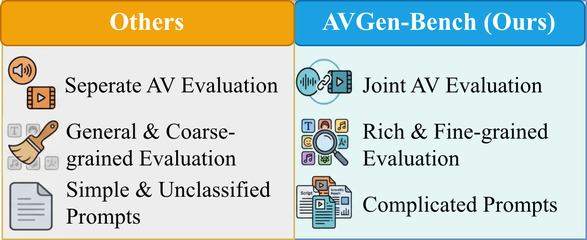

# AVGen-Bench

AVGen-Bench is a **task-driven benchmark** for multi-granular evaluation of Text-to-Audio-Video (T2AV) generation.

[](http://aka.ms/avgenbench)
[](https://arxiv.org/abs/2604.08540)
[](https://huggingface.co/datasets/microsoft/AVGen-Bench)

## Repository Information

- Support: see [SUPPORT.md](SUPPORT.md) for bug reports, usage questions, and issue filing guidance.
- Security: see [SECURITY.md](SECURITY.md) for responsible vulnerability reporting instructions.
- Code of Conduct: see [CODE_OF_CONDUCT.md](CODE_OF_CONDUCT.md) for community participation expectations.


<p align="center">
  
</p>
<p align="center"><em>
Compared with prior benchmarks, AVGen-Bench emphasizes joint audio-video evaluation,
fine-grained multi-dimensional assessment, and more complex task-oriented prompts.
</em></p>

## Benchmark Results

Following the paper's `10-dimension` narrative, `AV`/`Lip` are complementary measurements for synchronization, and `Lo-Phy`/`Hi-Phy` are complementary measurements for physical plausibility.

Metric direction: higher is better for `Vis`, `Aud (PQ)`, `Text`, `Face`, `Music`, `Speech`, `Lo-Phy`, `Hi-Phy`, and `Holistic`; lower is better for `AV` and `Lip`.

Models are sorted by `Total` in descending order. Best scores are in **bold**. Second-best scores are in *italics*.

Component labels in this README use text markers instead of color backgrounds.

| Model | Components | Vis | Aud (PQ) | AV | Lip | Text | Face | Music | Speech | Lo-Phy | Hi-Phy | Holistic | Total |
|---|---|---:|---:|---:|---:|---:|---:|---:|---:|---:|---:|---:|---:|
| Veo 3.1-fast | Veo 3.1-fast (Proprietary) | *0.960* | 6.64 | **0.21** | *2.39* | 75.10 | 52.77 | 3.13 | *94.53* | 3.68 | 67.43 | *86.27* | **67.87** |
| Veo 3.1-quality | Veo 3.1-quality (Proprietary) | 0.954 | 6.77 | 0.24 | 3.59 | *76.53* | 52.90 | 5.00 | **96.09** | 3.74 | *68.53* | 84.10 | *66.28* |
| Sora-2 | Sora-2 (Proprietary) | 0.848 | 5.91 | 0.25 | 4.50 | 74.84 | 51.17 | *7.81* | 88.63 | **4.05** | **78.95** | **88.89** | 64.16 |
| Wan2.6 | Wan2.6 (Proprietary) | 0.959 | *7.15* | 0.30 | 4.32 | **76.95** | 49.27 | 1.75 | 89.33 | 3.69 | 66.92 | 80.98 | 62.97 |
| Seedance-1.5 Pro | Seedance-1.5 Pro (Proprietary) | **0.970** | **7.48** | 0.26 | 3.43 | 38.28 | *54.42* | 1.88 | 93.45 | 3.72 | 66.88 | 77.38 | 62.55 |
| Kling-V2.6 | Kling-V2.6 (Proprietary) | 0.906 | 6.93 | **0.21** | **2.30** | 14.52 | **57.33** | 5.00 | 89.62 | 3.84 | 63.92 | 76.74 | 61.82 |
| LTX-2.3 | LTX-2.3 (Open-source) | 0.858 | 7.11 | 0.36 | **2.00** | 54.17 | 45.06 | 1.38 | 86.66 | *3.99* | 64.31 | 65.22 | 59.97 |
| NanoBanana2 + MOVA | NanoBanana2 (Proprietary) + MOVA (Open-source) | 0.890 | 6.71 | 0.44 | 2.70 | 68.26 | 41.33 | 0.59 | 82.45 | 3.91 | 60.95 | 72.48 | 58.10 |
| LTX-2 | LTX-2 (Open-source) | 0.828 | 6.84 | *0.23* | 4.76 | 24.76 | 48.53 | 5.75 | 87.07 | **4.05** | 60.20 | 66.59 | 56.62 |
| Emu3.5 + MOVA | Emu3.5 (Open-source) + MOVA (Open-source) | 0.911 | 6.80 | 0.38 | 4.83 | 64.72 | 48.44 | 0.62 | 81.74 | 3.89 | 55.85 | 66.55 | 56.12 |
| Wan2.2 + HunyuanVideo-Foley | Wan2.2 (Open-source) + HunyuanVideo-Foley (Open-source) | 0.936 | 6.60 | *0.23* | 5.38 | 48.46 | 36.23 | 3.44 | 53.40 | 3.90 | 54.11 | 60.63 | 53.29 |
| Ovi | Ovi (Open-source) | 0.839 | 6.31 | 0.37 | 5.40 | 41.36 | 49.05 | **11.25** | 76.49 | *3.93* | 52.92 | 57.45 | 52.02 |

## Failure Demo Videos

The following demos are selected from Appendix A failure cases.  
Preview images remain in `assets/failure_demos/`, while showcased videos are hosted through GitHub attachments to keep the repository lightweight.

<details open>
<summary><strong>Case 1: Prompted Text Rendering ("Your customers are talking")</strong></summary>

**Original Prompt**  
A single wind-up chattering teeth toy clacks continuously against a solid teal background. The scene cuts to a blue screen displaying the white text 'Your customers are talking,' abruptly followed by rows of multi-colored chattering teeth toys all moving at once, creating a loud chaotic mechanical clatter. A green screen appears with the text 'Are you listening?' before cutting to a generic product logo and a 'Try it free' button on a white background as the noise ceases.

#### Veo 3.1 Fast

https://github.com/user-attachments/assets/ce5bbd62-95d2-49f7-9066-3d4ee1d8b478


#### Ovi


https://github.com/user-attachments/assets/53e83129-116c-4a35-b6de-3ca03b6151ce


#### LTX-2


https://github.com/user-attachments/assets/5e9dd440-682f-4bfe-b066-f3555c776968


#### Kling 2.6


https://github.com/user-attachments/assets/c14fdae7-cdb1-42fa-8288-024556692a59


</details>

<details>
<summary><strong>Case 2: Trailer Title Rendering ("EIGHTY-SEVEN SECONDS")</strong></summary>

**Original Prompt**  
Four-shot high-tempo teaser with clean sync hits. Shot 1: Inside a bank vault, fluorescent hum and distant alarms; a timer on a device beeps faster as a thief whispers, "Eighty-seven seconds, move." Shot 2: Close-up of a glass cutter scoring a pane with a sharp scratch, then a suction cup pops as the circle lifts free, landing on a bass hit. Shot 3: Smash cut to a getaway car; engine revs, tires chirp, and the car fishtails out of a tight alley with gravel spraying and rattling off the chassis. Shot 4: A final slow-motion shot of a duffel bag hitting the pavement with a heavy thud as sirens surge; the title EIGHTY-SEVEN SECONDS slams onto black with a metallic logo sting.

#### Veo 3.1 Fast


https://github.com/user-attachments/assets/b63866bd-4e41-4064-b39f-fff363c505f4


#### Ovi


https://github.com/user-attachments/assets/6cb1b7c5-18b7-4244-9329-0a3545fd5ffd


#### LTX-2


https://github.com/user-attachments/assets/be4e461e-5484-4c67-a0e0-dff966a35f48


#### Kling 2.6

https://github.com/user-attachments/assets/68a00231-16cb-42de-b4bd-90d15a096e16


</details>

<details>
<summary><strong>Case 3: Physical Plausibility (Chladni Plate)</strong></summary>

**Original Prompt**  
A top-down view of a black square metal plate sprinkled evenly with fine white sand as a tone generator plays a pure sine wave that sweeps upward in pitch. As the plate begins to vibrate, the rising tone makes the sand suddenly jitter and chatter across the metal, then fall quiet as grains slide into crisp geometric nodal lines that sharpen and rearrange each time the pitch crosses a new resonance.

#### Veo 3.1 Fast


https://github.com/user-attachments/assets/5619e526-0bcc-48a5-ae94-c33651c22935


#### Ovi


https://github.com/user-attachments/assets/903aa4ab-fb5d-45e8-869d-839548068d3f


#### LTX-2


https://github.com/user-attachments/assets/30e206e6-5ee0-4cf7-9036-e5ab139eccd5


#### Kling 2.6
https://github.com/user-attachments/assets/259b07ee-ce60-4716-abcd-45f832c8cef2

</details>


<details>
<summary><strong>Case 4: Physical Plausibility (Briggs-Rauscher)</strong></summary>

**Original Prompt**  
A high-speed time-lapse shows a beaker on a magnetic stirrer, the stir plate motor making a steady whir as a stir bar spins. The beaker contains a Briggs-Rauscher mixture (hydrogen peroxide, potassium iodate, malonic acid, and a metal-ion catalyst with starch indicator). While the vortex turns, the liquid repeatedly cycles through several distinct visible states in a rhythmic pattern, switching abruptly and then returning again and again as the stirring continues.

#### Veo 3.1 Fast


https://github.com/user-attachments/assets/33ae200f-f2e5-43d8-9163-e2ec32c81c0d


#### Ovi


https://github.com/user-attachments/assets/8f7f9608-2e19-4a49-acf5-b56219453259


#### LTX-2


https://github.com/user-attachments/assets/5eb1d704-4644-4677-9877-4871f8b4e18d


#### Kling 2.6


https://github.com/user-attachments/assets/eaf93b2a-da33-425d-ab25-0a209706cf7a


</details>

<details>
<summary><strong>Case 5: Semantic Misalignment (Vacation Ad)</strong></summary>

**Original Prompt**  
A young boy hits a beach ball as a group of children runs past him and jumps into a swimming pool with loud splashes, while a voiceover states, 'We went on vacation with a toe dipper.' The camera follows the kids underwater as bubbles roar and feet kick past the lens, and the voiceover finishes, 'and left with a cannonballer.' Finally, the view resurfaces to show a laughing girl in the water as on-screen text reads 'Book your family home now.'

#### Veo 3.1 Fast


https://github.com/user-attachments/assets/0c6840c3-3d31-4cac-83fd-7eb905207744


#### Ovi


https://github.com/user-attachments/assets/e5445f47-7d15-4a70-b4e0-eca101d3ffbf


#### LTX-2


https://github.com/user-attachments/assets/09aeb6db-c209-41a5-b49e-0d166d05e46e


#### Kling 2.6


https://github.com/user-attachments/assets/a37f3668-1282-4f27-9a1d-bf09ff3a4d41


</details>

<details>
<summary><strong>Case 6: Music Pitch Accuracy (Single Note A4)</strong></summary>

**Original Prompt**  
A zoomed-in tutorial shot of a clean-tone electric guitar fretboard and picking hand. The player frets a single note A4 and plucks it four times with even timing, letting each note ring briefly. The pitch stays stable (no bend, no vibrato), and no other strings ring.

#### Veo 3.1 Fast


https://github.com/user-attachments/assets/ac201eca-4ef2-4199-994c-8fbdb179ea1e


#### Ovi


https://github.com/user-attachments/assets/40c2bd3a-ff91-4e7e-922b-34f8822708ea


#### LTX-2


https://github.com/user-attachments/assets/8ad286df-a751-4c42-9f4d-3d70c80f3e89


#### Kling 2.6


https://github.com/user-attachments/assets/b9200272-3f13-4a7a-9a9a-caa83350e45f


</details>


## Installation

To ensure reproducibility and minimize dependency conflicts, each evaluation module uses a dedicated Conda environment defined in `environments/*.yml`.

### 1. Prerequisites

- Linux with Conda installed (`Miniconda` or `Anaconda`)
- CUDA-enabled GPU for GPU-dependent modules

```bash
cd AVGen-Bench
```

> Note: the YAML files include historical `prefix` fields. Always pass `-n <env_name>` when creating environments to avoid local path conflicts.

### 2. Evaluation dimension to environment mapping

| Granularity | Evaluation Dimension | Module Directory | Environment YAML | Env Name |
|---|---|---|---|---|
| Basic Uni-modal | Visual Quality | `eval/Q-Align` | `environments/visual_quality.yml` | `q_align` |
| Basic Uni-modal | Audio Quality (Audiobox-Aesthetic) | `eval/audiobox-aesthetics` | `environments/audio_quality.yml` | `audiobox` |
| Basic Cross-modal | AV Sync | `eval/Syncformer` | `environments/avsync.yml` | `syncformer` |
| Basic Cross-modal | Lip Sync | `eval/syncnet_python` | `environments/lipsync.yml` | `syncnet` |
| Fine-grained Visual | Scene Text Rendering | `eval/Ocr` | `environments/text_rendering_quality.yml` | `ocr` |
| Fine-grained Visual | Facial Consistency | `eval/facial_consistency` | `environments/facial_consistency.yml` | `face` |
| Fine-grained Audio | Pitch Accuracy | `eval/music_check` | `environments/pitch_accuracy.yml` | `music` |
| Fine-grained Audio | Speech Intelligibility \& Coherence | `eval/speech` | `environments/speech_quality.yml` | `whisper` |
| Fine-grained Macro | Low-level Physical Plausibility | `eval/videophy` | `environments/low_level_physics.yml` | `videophy` |
| Fine-grained Macro | High-level Physical Plausibility | `eval/gemini_phy` | `environments/mllm.yml` | `mllm` |
| Fine-grained Macro | Holistic Semantic Alignment | `eval/plot_matching` | `environments/mllm.yml` | `mllm` |

### 3. Create environments (recommended: on demand)

Create only the environments required by the modules you plan to run.

```bash
# Visual quality
conda env create -f environments/visual_quality.yml -n q_align

# AV synchronization
conda env create -f environments/avsync.yml -n syncformer

# Shared MLLM environment (used by both eval/gemini_phy and eval/plot_matching)
conda env create -f environments/mllm.yml -n mllm
```

Activate the corresponding environment before running each module:

```bash
conda activate <env_name>
```

Module-specific extra setup:

- `syncnet`: after creating and activating the `syncnet` environment, download the pretrained SyncNet weights before evaluation:

```bash
conda activate syncnet
cd eval/syncnet_python
bash download_model.sh
```

This script downloads `data/syncnet_v2.model`, which is required by the lip-sync evaluation pipeline.

- `videophy`: the VideoPhy-2 auto-rater checkpoint `videophy_2_auto` must be downloaded into `eval/videophy/VIDEOPHY2/videophy_2_auto/` before running evaluation. This matches the command used later in this README:

```bash
git lfs install
git clone https://huggingface.co/videophysics/videophy_2_auto eval/videophy/VIDEOPHY2/videophy_2_auto
```

If you store the checkpoint elsewhere, replace `--checkpoint videophy_2_auto` with the corresponding local path when running `eval/videophy/VIDEOPHY2/batch_eval.py`.

### 4. (Optional) Create all environments in batch

```bash
for yml in environments/*.yml; do
  env_name=$(grep '^name:' "$yml" | awk '{print $2}')
  conda env create -f "$yml" -n "$env_name"
done
```

### 5. Verify installation

```bash
conda env list
```

### Repository Layout Notes

- `eval/` contains the integrated evaluation modules used by AVGen-Bench.
- The `benchmark` branch keeps the runtime code needed for benchmark evaluation, but intentionally does not track some large third-party training/example assets.
- In particular, large auxiliary assets such as `eval/Syncformer/data/`, `eval/videophy/asset/`, and `eval/videophy/preprint.pdf` are excluded from version control on the lightweight benchmark branch.
- If you need the full upstream training/example resources for a third-party module, fetch them from the original upstream repository rather than expecting them to be present in this benchmark branch.

## Prompt-based Generation

This repo now includes a prompt-driven generation framework:

- Entry script: `batch_generate.py`
- Core runner: `generation/runner.py`
- Client interface: `generation/clients/base.py`
- Built-in provider: `generation/clients/sora2.py`
- Additional providers: `generation/clients/kling26.py`, `generation/clients/wan26.py`, `generation/clients/seedance.py`, `generation/clients/ltx2.py`, `generation/clients/ovi.py`, `generation/clients/mova.py`

### 1. Generate videos from `prompts/*.json`

```bash
python batch_generate.py \
  --provider sora2 \
  --task_type video_generation \
  --prompts_dir ./prompts \
  --out_dir ./generated_videos/sora2 \
  --concurrency 2 \
  --seconds 12 \
  --size 1280x720
```

Output layout is evaluation-compatible:

```text
generated_videos/sora2/
  ads/<safe_filename(content)>.mp4
  animals/<safe_filename(content)>.mp4
  ...
```

Single-machine multi-GPU runs are supported. Provide `--gpu_ids` and set `--concurrency`
to the number of GPUs you want to use; tasks are assigned round-robin per GPU.
If `concurrency` exceeds the number of GPU IDs, some GPUs will run multiple tasks.

```bash
python batch_generate.py \
  --provider ltx2 \
  --prompts_dir ./prompts \
  --out_dir ./generated_videos/ltx2 \
  --concurrency 4 \
  --gpu_ids 0,1,2,3
```

### 2. Environment variables for `sora2`

```bash
export AZURE_OPENAI_API_KEY=...
export ENDPOINT_URL="https://xxxxx.openai.azure.com/"
export DEPLOYMENT_NAME="sora-2"
```

`ENDPOINT_URL` and `DEPLOYMENT_NAME` have defaults in code, while `AZURE_OPENAI_API_KEY` is required.

### 3. Other integrated providers

#### `kling26`

```bash
export KLING_ACCESS_KEY=...
export KLING_SECRET_KEY=...
export KLING_BASE_URL="https://api-beijing.klingai.com"

python batch_generate.py \
  --provider kling26 \
  --prompts_dir ./prompts \
  --out_dir ./generated_videos/kling26 \
  --concurrency 2
```

#### `wan26`

```bash
export DASHSCOPE_API_KEY=...
export DASHSCOPE_BASE_URL="https://dashscope.aliyuncs.com"

python batch_generate.py \
  --provider wan26 \
  --prompts_dir ./prompts \
  --out_dir ./generated_videos/wan26 \
  --concurrency 2
```

#### `seedance`

```bash
export ARK_API_KEY=...
export ARK_BASE_URL="https://ark.cn-beijing.volces.com/api/v3"

python batch_generate.py \
  --provider seedance \
  --prompts_dir ./prompts \
  --out_dir ./generated_videos/seedance \
  --concurrency 2
```

#### `ltx2`

`ltx2` provider uses the vendored LTX-2 source code already included in this repo under `third_party/LTX-2`.
Current integration targets the official `DistilledPipeline` for text-to-video.

Environment setup:

```bash
python -m venv .venv-ltx2
source .venv-ltx2/bin/activate

# Install runtime dependencies required by vendored ltx-core + ltx-pipelines
pip install "torch~=2.7" torchaudio einops numpy "transformers==4.53.3" \
  "tokenizers>=0.20.3" safetensors accelerate "scipy>=1.14" av tqdm pillow

# Optional performance extras
pip install xformers
```

If you keep LTX-2 in a dedicated environment, point the runner to that Python binary:

```bash
export LTX2_PYTHON_BIN="$(which python)"
```

Required weights for the current `ltx2` integration:

- `ltx-2.3-22b-distilled.safetensors`
- `ltx-2.3-spatial-upscaler-x2-1.0.safetensors`
- Gemma text encoder files from `google/gemma-3-12b-it-qat-q4_0-unquantized`

Recommended layout:

```text
/path/to/ltx2_models/
  ltx-2.3-22b-distilled.safetensors
  ltx-2.3-spatial-upscaler-x2-1.0.safetensors
  gemma-3-12b-it-qat-q4_0-unquantized/
```

Then configure:

```bash
export LTX2_MODELS_DIR=/path/to/ltx2_models
export LTX2_PYTHON_BIN=/path/to/.venv-ltx2/bin/python
```

Or set explicit paths instead:

```bash
export LTX2_DISTILLED_CHECKPOINT_PATH=/path/to/ltx-2.3-22b-distilled.safetensors
export LTX2_SPATIAL_UPSAMPLER_PATH=/path/to/ltx-2.3-spatial-upscaler-x2-1.0.safetensors
export LTX2_GEMMA_ROOT=/path/to/gemma-3-12b-it-qat-q4_0-unquantized
```

Weights download script (supports LTX-2 and LTX-2.3):

```bash
# Download LTX-2.3 distilled + spatial upscaler + Gemma
python scripts/download_ltx_weights.py \
  --version 2.3 \
  --models distilled \
  --spatial-upscaler x2 \
  --download-gemma \
  --output-dir /path/to/ltx2_models

# Download LTX-2 distilled + spatial upscaler (no Gemma)
python scripts/download_ltx_weights.py \
  --version 2 \
  --models distilled \
  --spatial-upscaler x2 \
  --output-dir /path/to/ltx2_models
```

Run generation:

```bash
python batch_generate.py \
  --provider ltx2 \
  --prompts_dir ./prompts \
  --out_dir ./generated_videos/ltx2 \
  --concurrency 1 \
  --ltx2_python_bin "$LTX2_PYTHON_BIN" \
  --ltx2_size 1280x704 \
  --ltx2_num_frames 241
```

Notes:

- `ltx2` currently supports `pipeline=distilled` only.
- The default size is `1280x704`, not `1280x720`, because the two-stage LTX-2 pipeline requires width and height divisible by 64.
- The default `ltx2_num_frames` is `241` (10s @ 24fps).
- You can use `--ltx2_quantization fp8-cast` on supported setups to reduce memory pressure.

#### `ovi`

`ovi` provider uses the vendored Ovi source code already included in this repo under `third_party/Ovi`.
You do not need to clone Ovi separately. You only need to prepare the Ovi checkpoints.

Environment setup:

```bash
cd third_party/Ovi
python -m venv .venv
source .venv/bin/activate

# Install PyTorch first. Choose the wheel that matches your CUDA/driver setup.
pip install torch==2.6.0 torchvision torchaudio

# Install Ovi dependencies vendored with this repo
pip install -r requirements.txt

# Optional but recommended for Ovi inference
pip install flash_attn --no-build-isolation
```

If you keep Ovi in a dedicated environment, point the runner to that Python binary:

```bash
export OVI_PYTHON_BIN="$(pwd)/.venv/bin/python"
```

Weights download:

```bash
cd third_party/Ovi
source .venv/bin/activate

# Download all default Ovi checkpoints plus Wan/MMAudio dependencies
python download_weights.py

# Or download to a custom directory
python download_weights.py --output-dir /path/to/ckpts

# Or only download the 10s model
python download_weights.py --output-dir /path/to/ckpts --models 960x960_10s
```

This downloads the Ovi model weights together with the required Wan and MMAudio components. By default they are stored under `third_party/Ovi/ckpts`.

Optional fp8 checkpoint for lower VRAM setups:

```bash
wget -O "./ckpts/Ovi/model_fp8_e4m3fn.safetensors" \
  "https://huggingface.co/rkfg/Ovi-fp8_quantized/resolve/main/model_fp8_e4m3fn.safetensors"
```

When using a custom checkpoint directory, set `OVI_CKPT_DIR` or pass `--ovi_ckpt_dir`.

```bash
# Optional: override checkpoint directory
export OVI_CKPT_DIR=/path/to/ckpts
export OVI_PYTHON_BIN=/path/to/third_party/Ovi/.venv/bin/python

python batch_generate.py \
  --provider ovi \
  --prompts_dir ./prompts \
  --out_dir ./generated_videos/ovi \
  --concurrency 1 \
  --ovi_ckpt_dir "$OVI_CKPT_DIR" \
  --ovi_python_bin "$OVI_PYTHON_BIN" \
  --ovi_model_name 960x960_10s \
  --ovi_mode t2v \
  --ovi_size 1280x720
```

The vendored Ovi helper for downloading weights is available at `third_party/Ovi/download_weights.py`.

#### `mova` (TI2AV)

`mova` provider integrates the open-source [OpenMOSS/MOVA](https://github.com/OpenMOSS/MOVA) model for **TI2AV** (first-frame image + prompt -> audio-video).

Notes:

- MOVA is not vendored in this repo. Clone it (or use a submodule) under `third_party/MOVA`, or set `MOVA_REPO_DIR` to point to your local clone.
- You need to download MOVA checkpoints (e.g. `OpenMOSS-Team/MOVA-360p` or `OpenMOSS-Team/MOVA-720p`) separately.
- `mova` requires a first-frame image per prompt. This repo passes a `ref_path` image into MOVA's official `scripts/inference_single.py`.

Installation (recommended in a dedicated environment):

```bash
git clone https://github.com/OpenMOSS/MOVA third_party/MOVA
cd third_party/MOVA

# Follow MOVA upstream README for exact environment requirements.
# Minimal: install MOVA package and its dependencies in the active env.
pip install -e .
```

Checkpoint download:

```bash
# Install Hugging Face CLI if needed
pip install -U "huggingface_hub[cli]"

# Login first if the repo requires authentication in your environment
huggingface-cli login

# Download the 720p checkpoint
hf download OpenMOSS-Team/MOVA-720p --local-dir /path/to/MOVA-720p

# Or download the 360p checkpoint
hf download OpenMOSS-Team/MOVA-360p --local-dir /path/to/MOVA-360p
```

Recommended local layout:

```text
/path/to/checkpoints/
  MOVA-360p/
  MOVA-720p/
```

Then pass the checkpoint directory with `--mova_ckpt_path`. For example:

```bash
--mova_ckpt_path /path/to/checkpoints/MOVA-720p
```

Resolution guidance:

- `MOVA-360p` is the lighter checkpoint and typically pairs with `--mova_height 352 --mova_width 640`
- `MOVA-720p` is the higher-resolution checkpoint and pairs with `--mova_height 720 --mova_width 1280`

Run batch generation with first-frame images:

```bash
python batch_generate.py \
  --provider mova \
  --prompts_dir ./prompts \
  --out_dir ./generated_videos/mova \
  --concurrency 1 \
  --image_dir ./generated_images/nanobanana2 \
  --mova_ckpt_path /path/to/MOVA-720p \
  --mova_cp_size 1 \
  --mova_height 720 \
  --mova_width 1280
```

The `--image_dir` should contain first-frame images saved as:

```text
<image_dir>/<category>/<safe_filename(content)>.png
```

Accepted extensions are `.png`, `.jpg`, `.jpeg`, `.webp`, `.bmp`. If you already have per-item image paths, you can also put `ref_path` into the prompt JSON items to bypass `--image_dir` mapping.

If you want to use multiple GPUs for one video via MOVA context parallel, set `--mova_cp_size` and keep `--concurrency 1`. In that case, set `CUDA_VISIBLE_DEVICES` explicitly instead of relying on `--gpu_ids`.


### 4. Re-run control

- Skip existing outputs (default behavior)
- Force regenerate with `--rerun_existing`

```bash
python batch_generate.py --provider sora2 --rerun_existing
```

### 5. Reserved `image_generation` interface (for future models)

The framework includes an `image_generation(prompt, **kwargs)` interface in `generation/clients/base.py`.

To test your own model in the future:

1. Add a new client class under `generation/clients/` inheriting `BaseGenerationClient`.
2. Implement `video_generation(...)` and optionally `image_generation(...)`.
3. Register the provider key in `create_client()` in `generation/runner.py`.
4. Run with:

```bash
python batch_generate.py --provider <your_provider> --task_type image_generation
```

## Evaluation

All evaluation commands must be executed **inside the corresponding `eval/` module subdirectory**.

> Replace the example paths (e.g., `/path/to/...`) with your local paths.

### One-click full evaluation script

We provide a single script to run the full evaluation suite end-to-end:

```bash
bash run_full_evaluation.sh
```

Default arguments:

- `--prompts-dir prompts`
- `--videos-dir generated_videos/veo3.1_fast`
- `--output-dir avgenbench`
- `--run-tag <basename(videos-dir)>`

You can override them as follows:

```bash
bash run_full_evaluation.sh \
  --prompts-dir /path/to/prompts \
  --videos-dir /path/to/generated_videos \
  --output-dir /path/to/avgenbench \
  --run-tag veo3.1_fast
```

Notes:

- The script executes each module in its own subdirectory automatically.
- Gemini-dependent modules are skipped when neither `GEMINI_API_KEY` nor `GOOGLE_API_KEY` is set.
- Additional optional flags: `--workers`, `--syncformer-exp-name`, `--videophy-checkpoint`, `--run-tag`.
- Output layout follows avgenbench style:
  - `q_align/<run_tag>.csv`
  - `audiobox_aesthetic/<run_tag>.csv`
  - `av_sync/<run_tag>.csv`
  - `syncnet/<run_tag>/result.csv`
  - `videophy2/<run_tag>.csv`
  - `ocr/<run_tag>/results_text_quality.csv`
  - `gemini_phy2/<run_tag>/summary.csv`
  - `facial/<run_tag>/eval_results.json`
  - `plot_matching/<run_tag>/eval_results.json`
  - `music/<run_tag>/summary.json`
  - `speech/<run_tag>/summary.json`
- After module evaluation, the script computes an aggregate score and saves:
  - `avgenbench/overall_score/<run_tag>.json`
  - `avgenbench/overall_score/<run_tag>.csv`

### Aggregate Total Score (Scheme 2)

AVGen-Bench provides an aggregate score computed from 3 groups:
For paper-level reporting, we keep the "10 dimensions" narrative, where cross-modal synchronization is one dimension with `AV`/`Lip` as complementary measurements, and physical plausibility is one dimension with `Lo-Phy`/`Hi-Phy` as complementary measurements.

- `Basic Uni-modal`: `Vis`, `Aud(PQ)`
- `Basic Cross-modal`: one synchronization dimension reported by two complementary indicators (`AV`, `Lip`)
- `Fine-grained`: `Text`, `Face`, `Music`, `Speech`, `Lo-Phy`, `Hi-Phy`, `Holistic`

Group weights:

- `Basic Uni-modal`: `0.2`
- `Basic Cross-modal`: `0.2`
- `Fine-grained`: `0.6`

Metric normalization to `0-100`:

- `Vis_n = Vis * 100`
- `Aud_n = Aud(PQ) * 10`
- `AV_n = 100 * max(0, 1 - AV / 0.5)` (lower is better)
- `Lip_n = 100 * max(0, 1 - Lip / 8)` (lower is better)
- `LoPhy_n = Lo-Phy * 20`
- `Text/Face/Music/Speech/Hi-Phy/Holistic` are already in `0-100`

By default, per-metric weights are equal inside each group.

You can run aggregation separately:

```bash
python aggregate_score.py \
  --output-dir avgenbench \
  --run-tag veo3.1_fast \
  --save-json avgenbench/overall_score/veo3.1_fast.json \
  --save-csv avgenbench/overall_score/veo3.1_fast.csv
```

### Q-Align (Visual Quality)

```bash
conda activate q_align
cd eval/Q-Align
python batch_eval.py --root /path/to/video_generation/wan22_hunyuanFoley --save_summary_csv /path/to/avgenbench/q_align/wan22_hunyuanFoley.csv
```

### Audiobox-Aesthetic (Audio Quality)

```bash
conda activate audiobox
cd eval/audiobox-aesthetics
python batch_eval.py --root /path/to/video_generation/wan22_hunyuanFoley --save_summary_csv /path/to/avgenbench/audiobox_aesthetic/wan22_hunyuanFoley.csv
```

### Synchformer (AV Sync)

```bash
conda activate syncformer
cd eval/Syncformer
python batch_eval.py --root /path/to/video_generation/wan22_hunyuanFoley --save_summary_csv /path/to/avgenbench/av_sync/wan22_hunyuanFoley.csv --exp_name "24-01-04T16-39-21"
```

### OCR (Scene Text Rendering)

```bash
conda activate ocr
cd eval/Ocr
python batch_eval.py --root /path/to/video_generation/wan22_hunyuanFoley --out_dir /path/to/avgenbench/ocr/wan22_hunyuanFoley --prompts_dir /path/to/video_generation/prompts --gemini_workers 32
```

### SyncNet (Lip Sync)

```bash
conda activate syncnet
cd eval/syncnet_python
python batch_eval.py \
  --video_root /path/to/video_generation/wan22_hunyuanFoley \
  --save_csv /path/to/avgenbench/syncnet/wan22_hunyuanFoley/result.csv \
  --conf_th 1.0 \
  --inference_py inference.py
```

### VideoPhy2 (Low-level Physical Plausibility)

```bash
conda activate videophy
cd eval/videophy/VIDEOPHY2
python batch_eval.py --root /path/to/video_generation/wan22_hunyuanFoley --save_summary_csv /path/to/avgenbench/videophy2/wan22_hunyuanFoley.csv --checkpoint videophy_2_auto --task pc
```

### Gemini Phy (High-level Physical Plausibility)

```bash
conda activate mllm
cd eval/gemini_phy
export GEMINI_API_KEY="YOUR_GEMINI_API_KEY"
python batch_eval.py \
  --root_videos /path/to/video_generation/wan22_hunyuanFoley \
  --prompts_dir /path/to/video_generation/prompts \
  --model gemini-3-flash-preview \
  --expectations_cache cache/expectations_cache.json \
  --out_dir /path/to/avgenbench/gemini_phy2/wan22_hunyuanFoley \
  --save_csv /path/to/avgenbench/gemini_phy2/wan22_hunyuanFoley/results.csv \
  --save_summary_csv /path/to/avgenbench/gemini_phy2/wan22_hunyuanFoley/summary.csv \
  --workers 32
```

### Facial Quality (Facial Consistency)

```bash
conda activate face
cd eval/facial_consistency
export ORT_CUDNN_CONV_ALGO_SEARCH=DEFAULT
python batch_eval.py \
  --prompts_dir /path/to/AVGen-Bench/eval/facial_consistency/prompts_expected_faces \
  --root_videos /path/to/video_generation/wan22_hunyuanFoley \
  --out_json /path/to/avgenbench/facial/wan22_hunyuanFoley/eval_results.json \
  --ctx_id 0
```

### Plot Matching (Holistic Semantic Alignment)

```bash
conda activate mllm
cd eval/plot_matching
export GEMINI_API_KEY="YOUR_GEMINI_API_KEY"
python batch_eval.py \
  --prompts_dir /path/to/video_generation/prompts \
  --root_videos /path/to/video_generation/wan22_hunyuanFoley \
  --out_json /path/to/avgenbench/plot_matching/wan22_hunyuanFoley/eval_results.json
```

### Music Check (Pitch Accuracy)

```bash
conda activate music
cd eval/music_check
export GEMINI_API_KEY="YOUR_GEMINI_API_KEY"
python batch_eval.py \
  --videos-root /path/to/video_generation/wan22_hunyuanFoley \
  --prompts-root /path/to/video_generation/prompts \
  --outputs-root /path/to/avgenbench/music/wan22_hunyuanFoley/per_video_result \
  --summary-out /path/to/avgenbench/music/wan22_hunyuanFoley/summary.json \
  --only-category musical_instrument_tutorial \
  --workers 32 \
  --constraints-cache-dir cache/music_prompt_constraints
```

### Speech (Speech Intelligibility \& Coherence)

```bash
conda activate whisper
cd eval/speech
export GEMINI_API_KEY="YOUR_GEMINI_API_KEY"
python batch_eval.py \
  --videos_root /path/to/video_generation/ltx2 \
  --prompts_dir /path/to/video_generation/prompts \
  --out_dir /path/to/avgenbench/speech/ltx2 \
  --gemini_workers 32 \
  --whisper_model large-v3
```

## Acknowledgements

We gratefully acknowledge the open-source projects and toolkits that power AVGen-Bench and its evaluation modules, including:

- [`Q-Align`](https://github.com/Q-Future/Q-Align) (`eval/Q-Align/`) for visual quality evaluation.
- [`Audiobox-Aesthetic`](https://github.com/facebookresearch/audiobox-aesthetics) (`eval/audiobox-aesthetics/`) for audio production quality evaluation.
- [`Synchformer`](https://github.com/v-iashin/Synchformer) (`eval/Syncformer/`) and [`SyncNet`](https://github.com/joonson/syncnet_python) (`eval/syncnet_python/`) for cross-modal synchronization evaluation.
- [`VideoPhy`](https://github.com/Hritikbansal/videophy) / [`VideoPhy2`](eval/videophy/VIDEOPHY2/) (`eval/videophy/`) for low-level physical plausibility evaluation.
- [`PaddleOCR`](https://github.com/PaddlePaddle/PaddleOCR) (used in `eval/Ocr/`) for scene text extraction.
- [`InsightFace`](https://github.com/deepinsight/insightface) (used in `eval/facial_consistency/`) for facial representation and consistency analysis.
- [`Faster-Whisper`](https://github.com/SYSTRAN/faster-whisper) (used in `eval/speech/`) for speech transcription.
- [`Basic Pitch`](https://github.com/spotify/basic-pitch) (used in `eval/music_check/`) for symbolic music transcription.
- [`Gemini API (Python)`](https://ai.google.dev/gemini-api/docs/python) via `google-generativeai` (used in `eval/gemini_phy/`, `eval/plot_matching/`, `eval/speech/`, `eval/music_check/`, and `eval/Ocr/`) for MLLM-based reasoning modules.

Please refer to the original repositories, papers, and licenses of these projects for attribution, usage terms, and model-specific restrictions.

## Citation

If you find AVGen-Bench useful, please cite:

```bibtex
@misc{zhou2026avgenbenchtaskdrivenbenchmarkmultigranular,
      title={AVGen-Bench: A Task-Driven Benchmark for Multi-Granular Evaluation of Text-to-Audio-Video Generation}, 
      author={Ziwei Zhou and Zeyuan Lai and Rui Wang and Yifan Yang and Zhen Xing and Yuqing Yang and Qi Dai and Lili Qiu and Chong Luo},
      year={2026},
      eprint={2604.08540},
      archivePrefix={arXiv},
      primaryClass={cs.CV},
      url={https://arxiv.org/abs/2604.08540}, 
}
```
